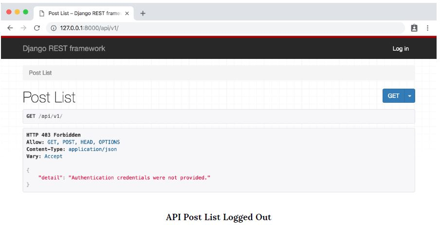
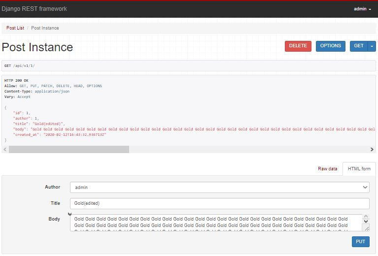
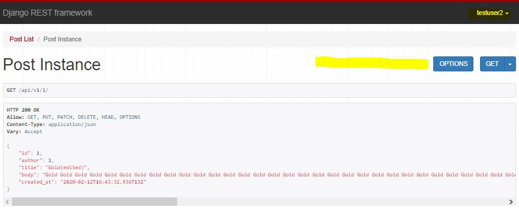
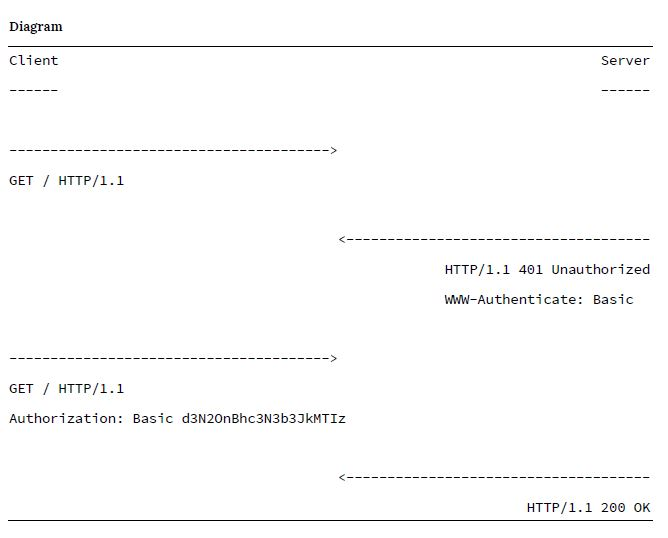
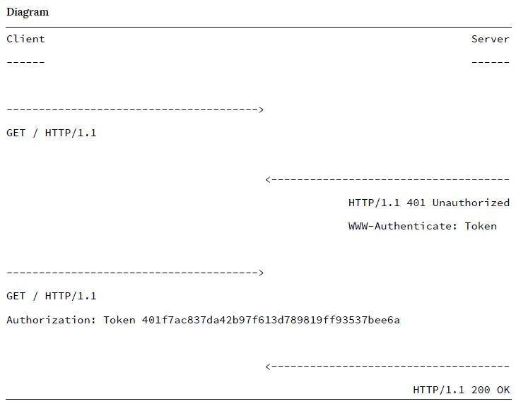

- Common convention : api/v1 {tracking the version of API}
- **ListAPIView** -> Read only endpoint collection, **RetrieveAPIView** -> Read only single endpoint, **ListCreateAPIView** -> read/write endpoint, **RetrieveUpdateDestroyAPIView** -> read, update, delete
- Code in views:
```python
# posts/views.py

# Import generics, models and serializers
from rest_framework import generics
from .models import Post
from .serializers import PostSerializer

class PostList(generics.ListCreateAPIView):
    queryset = Post.objects.all()
    serializer_class = PostSerializer

class PostDetail(generics.RetrieveUpdateDestroyAPIView):
    queryset = Post.objects.all()
    serializer_class = PostSerializer
```
- All we have to do is update our generic view to radically change the behavior of a given API endpoint.
- api/v1 => list and create endpoint
- api/v1/1 => list specific, update and delete viewpoint

---

## Perimissions (Authorization)
Django REST Framework ships with several out-of-the-box permissions settings that we can use to secure our API. These can be applied at a project-level, a view-level, or at any individual model level.

### Add log in to the browsable API:
Within the project-level urls.py file, add a new URL route that includes rest_framework.urls. Somewhat confusingly, the actual route specified can be anything we want; what matters is that rest_framework.urls is included somewhere. We will use the route api-auth since that matches official documentation, but we could just as easily use anything-we-want and everything would work just the same.
```python
from django.contrib import admin
from django.urls import include, path

urlpatterns = [
    ...
    path('api-auth/', include('rest_framework.urls')),
]
```

### AllowAny:
- Dont expose API ko everyone
- previously we set project level permission to AllowAny in settings.py as:
```python
REST_FRAMEWORK = {
    'DEFAULT_PERMISSION_CLASSES': [
        'rest_framework.permissions.AllowAny',
    ]
}
```
### View-Level Permissions:
- We want to restrict API to authenticated users. (Possible to do from project-level, view-level, object-level)
- import permission and add permission_classes field to each view
    ```python
    from rest_framework import generics, permissions
    ...

    class PostList(generics.ListCreateAPIView):
        permission_classes = (permissions.IsAuthenticated,)
        ...

    class PostDetail(generics.RetrieveUpdateDestroyAPIView):
        permission_classes = (permissions.IsAuthenticated,)
        ...
    ```
- Here's what browsable API shows at the endpoint:



### Project-Level Permissions:
Django REST Framework ships with a number of built-in project-level permissions settings we can use, including:
- **AllowAny** - any user, authenticated or not, has full access
- **IsAuthenticated** - only authenticated, registered users have access
- **IsAdminUser** - only admins/superusers have access
- **IsAuthenticatedOrReadOnly** - unauthorized users can view any page, but only authenticated users have write, edit, or delete privileges 

Implementing any of these four settings requires updating the ```DEFAULT_PERMISSION_CLASSES``` setting and refreshing our web browser
```python
REST_FRAMEWORK = {
    'DEFAULT_PERMISSION_CLASSES': [
        'rest_framework.permissions.IsAuthenticated',
    ]
}
```
- You can delete the permission_classes in views

### Custom Permissions
We want only the author of a specific blog post to be able to edit or delete it; otherwise the blog post should be read-only. So the superuser account should have full CRUD access to the individual blog instance, but the regular user testuser should not.

- Create a new permissions.py file in posts app, Internally DRF relies on BasePermission class from which all other permission classes inherit. (such as *AllowAny*, *IsAuthenticated*, ...)
- To create our own custom permission, we will override the ```has_object_permission``` method
- We want to allow read-only for all requests but for any write requests, such as edit or delete, the author must be the same as the current logged-in user.
- Code of post/permissions.py:
```python
# posts/permissions.py
from rest_framework import permissions # Import the permission

# Create a custom class that extends BasePermission
class IsAuthorOrReadOnly(permissions.BasePermission):

    # Override base class method
    def has_object_permission(self, request, view, obj):
        # Read-only permissions are allowed for any request
        if request.method in permissions.SAFE_METHODS:
            # If the request contains HTTP verbs included in 
            # SAFE_METHODS a tupule of (GET, OPTIONS, HEAD) grant the
            # permission
            return True
        
        # Write permissions are only allowed to the author of a post
        return obj.author == request.user
```

- Code in posts/views.py:
    ```python
    ...
    from .permissions import IsAuthorOrReadOnly
    ...
    class PostDetail(generics.RetrieveUpdateDestroyAPIView):
        permission_classes = (IsAuthorOrReadOnly,)
        queryset = Post.objects.all()
        serializer_class = PostSerializer
    ```
    
    

- localhost:8000/api/v1/1 -> login as admin then you can CRUD, but log in as testuser, you can only read. 
- Readonly for other user and full access to author is provided. 
- Note that the generic views will only check the object-level permissions for views that retrieve a single model instance. If you require object-level filtering of list views–for a collection of instances–you’ll need to filter by [overriding the initial queryset](https://www.django-rest-framework.org/api-guide/filtering/#overriding-the-initial-queryset).

Setting proper permissions is a very important part of any API. As a general strategy, it is a good idea to set a strict project-level permissions policy such that only authenticated users can view the API. Then make view-level or custom permissions more accessible as needed on specific API endpoints.

## User Authentication:
- Process by which user can register for a new account, log in with it, and log out
- Traditionally session based cookie pattern used for authentication.
- HTTP is a stateless protocol so there is no built-in way to remember if a user is authenticated from one request to the next. Each time a user requests a restricted resource it must verify itself.
- The solution is to pass along a unique identifier with each HTTP request.
- DRF has four different built-in authentication options and there are many more third-party packages that offer additional feature like JSON Web Token (JWTs)

### Basic Authentication:
- When a client makes an HTTP request, it is forced to send an approved authentication credential before access is granted.
- The complete request/response flow looks like this:
    1. Client makes an HTTP request
    2. Server responds with an HTTP response containing a 401 (Unauthorized) status code and WWW-Authenticate HTTP header with details on how to authorize
    3. Client sends credentials back via the Authorization HTTP header
    4. Server checks credentials and responds with either 200 OK or 403 Forbidden status code
- Once approved, the client sends all future requests with the Authorization HTTP header credentials. We can also visualize this exchange as follows:

- Note that the authorization credentials sent are the unencrypted base64 encoded version of <username>:<password>. So in author's case, this is wsv:password123 which with base64 encoding is d3N2OnBhc3N3b3JkMTIz
- The primary advantage of this approach is its simplicity. But there are several major downsides. First, on every single request the server must look up and verify the username and password, which is inefficient. It would be better to do the look up once and then pass a token of some kind that says, this user is approved. Second, user credentials are being passed in clear text—not encrypted at all—over the internet. This is incredibly insecure. Any internet traffic that is not encrypted can easily be captured and reused. Thus basic authentication should only be used via HTTPS, the secure version of HTTP. 

### Session Authentication:
- combination of sessions and cookies
- At a high level, the client authenticates with its credentials (username/password) and then receives a session ID from the server which is stored as a cookie.
- This session ID is then passed in the header of every future HTTP request.
- When the session ID is passed, the server uses it to look up a session object containing all available information for a given user, including credentials.
- This approach is stateful because a record must be kept and maintained on both the server (the session object) and the client (the session ID).
- Let's review the basic flow:
    1. A user enters their log in credentials (typically username/password)
    2. The server verifies the credentials are correct and generates a session object that is then stored in the database
    3. The server sends the client a session ID—not the session object itself—which is stored as a cookie on the browser
    4. On all future requests the session ID is included as an HTTP header and, if verified by the database, the request proceeds
    5. Once a user logs out of an application, the session ID is destroyed by both the client and server
    6. If the user later logs in again, a new session ID is generated and stored as a cookie on the client
- The default setting in Django REST Framework is actually a combination of Basic Authentication and Session Authentication. Django’s traditional session-based authentication system is used and the session ID is passed in the HTTP header on each request via Basic Authentication.
- More secure and less work - don't have to verify every time. 
- Downsides: 
    - Session ID is only valid within the browser where log in was performed; it will not work across multiple domains. (There might be multiple frontends - mobile apps and website)
    - Keeping session object up-to-date is challenging in large site with multiple servers, How do we maintain accuracy of a session object across each server? 
    - Cookie is sent out for every single request, that doesn't require authentication, but is inefficient. 
- Not advised to use a session-based authentication scheme for any API that will have multiple front-ends.

### Token Authentication:
- **Stateless**, client sends initial user credentials to the server, a unique token is generated and then stored by the client as either a cookie or in a local storage.
- This token is then passed in the header of each incoming HTTP request and the server uses it to verify that a user is authenticated.
- The server itself does not keep a record of the user, just whether a token is valid or not.
- Cookies vs Localstorage:
    - Cookies are used for reading server-side information. They are smaller in size(4 KB). They are automatically sent with each HTTP request.
    - Local Storage is designed for client-side information. It is much larger(5120 KB) and its contents are not sent by default with each HTTP request.
    - Tokens stored in both cookies and localstorage are vulnerable to XSS attacks. The current best practice is to store tokens in a cookie with the **httpOnly** and **Secure cookie** flags.
- Let's look at a simple version of actual HTTP messages in this challenge/response flow. Note that the HTTP header **www-Authenticate** specifies the use of a Token which is used in the response **Authorizaion** header request. 


- Pros and Cons:
    - Since tokens are stored on the client scaling the servers to maintain up-to-date session objects is no longer an issue. And tokens can be shared amongst multiple front-ends: *the same user can represent a user on the website and the same user on a mobile app*. The same session ID can not be shared amongst different front-ends, a major limitation.
    - A potential downside is that tokens can grow quite large. A token contains all user information, not just an id as with a session id/session object set up. Since the token is sent on every request, managing its size can become a performance issue.
- DRF built in TokenAuthenticatioin is deliberately quite basic. As a result, it does not support tokens to expire, which is a security improvement that can be added. It also only generates one token per user, so a user on a website and then later a mobile app will use the same token. Since information about the user is store locally, this can cause problem with maintaining and updating twor sets of client information.
- JSON Web Tokens(JWTs) are a new, enhanced version of tokens that can be added to DRF via several third-party packages. JWTs have several benefits including the ability to generate unique client tokens and token expiration. They can either be generated on the server or with a third-party service like Auth0. And JWTs can be encrypted which makes them safer to send over unsecured HTTP connections.
- In this  We are using built-in TokenAuthentication only.

#### Default Authentication:
- First step - configure authenticatioin settings. Default is set to Basic and Session Auth. 
```python
REST_FRAMEWORK = {
    ...
    'DEFAULT_AUTHENTICATION_CLASSES': [
            'rest_framework.authentication.SessionAuthentication',
            'rest_framework.authentication.BasicAuthentication',
    ],
    ...
```
- We have used both methods because they server different purposes, Session power browsable API and the ability to log in and log out of it. BasicAuthentication is used to pass the session ID in the HTTP headers for the API itself.

#### Implementing Token Authentication:
- Update our authentication sustem to use tokens.
```python
REST_FRAMEWORK = {
    ...
    'DEFAULT_AUTHENTICATION_CLASSES': [
            'rest_framework.authentication.SessionAuthentication',
            'rest_framework.authentication.TokenAuthentication',
    ],
    ...
```
- Update our DEFAULT_AUTHENTICATION_CLASSES setting to use TokenAuthentication
- We keep SessionAuthentication since we still need it for our Browsable API, but now use tokens to pass authentication credentials back and forth in our HTTP headers.
- We need to add the ```authtoken``` app which generates the token on the server. It comes included with DRF but must be adde to our INSTALLED_APPS setting. sync the db, migrate.
```python
INSTALLED_APPS = [
    
    ...
    'rest_framework.authtoken',

    ...
]

```
- In admin panel there is a token. 
- Tokens are only generated after there is an API call for a user to log in. 

#### Endpoints:
- Create endpoints so users can log in and log out. 
- A third party app is there for this purpose, django-rest-auth and django-allauth. ```pip install django-rest-auth```
- Settings.py
```python
INSTALLED_APPS = [
    ...
    'rest_auth'
    ...
]
```
- blog_project/urls.py:
```python
urlpatterns = [
    ...
    path('api/v1/rest-auth/', include('rest_auth.urls')),
    ...
]
```
- The endpoint provided are :
    1. http://127.0.0.1:8000/api/v1/rest-auth/login/.
    2. http://127.0.0.1:8000/api/v1/rest-auth/logout/.
    3. http://127.0.0.1:8000/api/v1/rest-auth/password/reset
    4. http://127.0.0.1:8000/api/v1/rest-auth/password/reset/confirm
#### User Registration:
- Use django-allauth, registration and social(Google, Facebook, ...) authentication features. ```pip install django-allauth```
- Add ```rest_auth.registration``` from django-rest-auth package then you have registration endpoints too. 
- Update settings.py:
```python
INSTALLED_APPS = [
    ...
    'django.contrib.sites',

    # 3-rd party apps
    ...
    'allauth',
    'allauth.account',
    'allauth.socialaccount',
    'rest_auth',
    'rest_auth.registration',

    ...
]
... 
EMAIL_BACKEND = 'django.core.mail.backends.console.EmailBackend'

SITE_ID = 1
```
- Email back-end config is needed since by default an email will be sent when a new user is registered, asking them to confirm their account. Rather than also set up an email server, we will output the emails to the console with the console.EmailBackend setting. 
- SITE_ID is part of built-in Django "sites" framework which is a way to host multiple sites from the same Django project. django-allauth uses sites framework, so we must specify a default setting.
- We have added new apps, so it's time to update the database.
- Add new URL route for registration.
```python
urlpatterns = [
    ...
    path('api/v1/rest-auth/registration/', include('rest_auth.registration.urls')),
    ...
```
- There is a user registration endpoint at: ```http://127.0.0.1:8000/api/v1/rest-auth/registration/```

#### Tokens:
- To make sure everything works, create a third user account via the browsable API endpoint. 
- The next screen shows the HTTP response from the server which return token in the browser and verification text in the console. This default text can be updated and an email SMTP server added with additional configuration. (Consult Django for beginners for that) 
- A single token will also be created for the registered user which can be seen from the admin panel.
- In our front-end framework, we would need to capture and store this token on the client either in localStorage or as a cookie. Then configure our application so that all future requests include the token in the header as a way to authenticate the user. 


